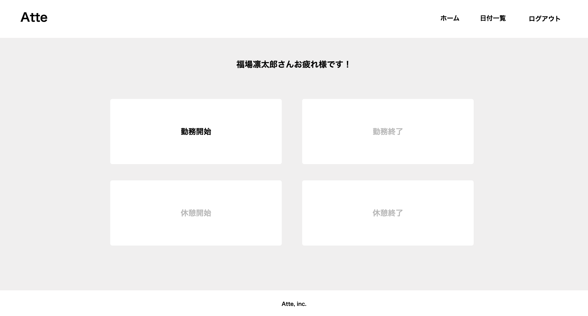
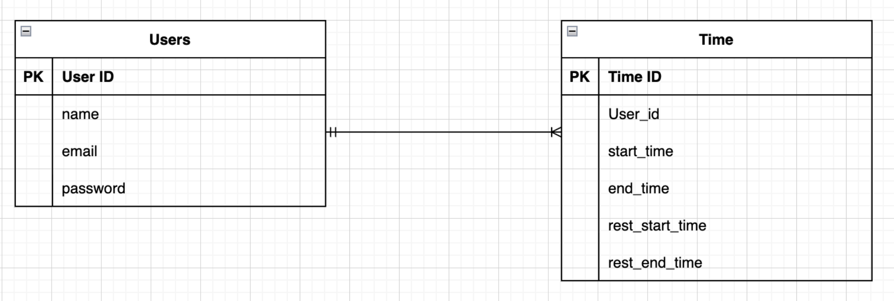

# Atte
勤怠管理アプリ

## 作成した目的
人事評価のため

## アプリケーションURL
http://localhost/

## 機能一覧
ログイン/ログアウト機能
会員登録機能
勤務開始/終了時刻記録機能
休憩開始/終了時刻記録機能

## 使用技術
- PHP 8.0
- Laravel 8.x
- MySQL 8.0

## テーブル設計

## ER図

## 環境構築
1. docker-compose exec php bash
2. composer install
3. .env.exampleファイルから.envを作成し、環境変数を変更
4. php artisan key:generate
5. php artisan migrate

## 備考
